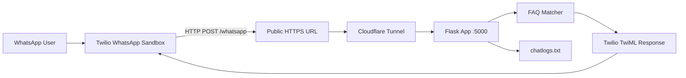

# WhatsApp FAQ Automation Bot

A lightweight, production-ready pattern for building a **rule-based WhatsApp assistant** using Python, Flask, and the Twilio WhatsApp API. Incoming messages are matched against a configurable FAQ dictionary, replies are sent instantly via Twilio, and every conversation is persisted to a local log file for review.

Ideal for small businesses, demos, and learning how WhatsApp webhooks work end-to-end without heavy infrastructure.

---

## Features

| Capability | Description |
|------------|-------------|
| **FAQ auto-replies** | Keyword-based responses (`hi`, `price`, `services`, etc.) |
| **Webhook integration** | Twilio POSTs messages to your Flask endpoint |
| **Conversation logging** | Timestamped user/bot exchanges in `chatlogs.txt` |
| **Local development** | Run on `localhost` with optional Cloudflare Tunnel for public HTTPS |
| **Extensible design** | Swap the FAQ map for AI, databases, or admin dashboards later |

---

## Architecture



1. User sends a message on WhatsApp.
2. Twilio forwards the payload to your webhook URL.
3. Cloudflare Tunnel exposes your local Flask server over HTTPS.
4. Flask normalizes the message, looks up a reply, logs the exchange, and returns TwiML.
5. Twilio delivers the reply back to the user.

---

## Tech Stack

| Technology | Role |
|------------|------|
| [Python 3](https://www.python.org/) | Runtime |
| [Flask](https://flask.palletsprojects.com/) | HTTP server & webhook handler |
| [Twilio](https://www.twilio.com/) | WhatsApp messaging API |
| [Cloudflare Tunnel](https://developers.cloudflare.com/cloudflare-one/connections/connect-networks/) | Secure public URL during development |

---

## Prerequisites

Before you begin, ensure you have:

- **Python 3.8+** installed with **Add Python to PATH** enabled
- A [Twilio](https://www.twilio.com/try-twilio) account (free tier is sufficient for the sandbox)
- [cloudflared](https://developers.cloudflare.com/cloudflare-one/connections/connect-networks/downloads/) installed for local webhook testing
- A WhatsApp account on your phone

---

## Project Structure

```
Whatsapp_Automation/
└── whatsapp_bot/
    ├── app.py              # Flask application & FAQ logic
    ├── requirements.txt    # Python dependencies
    └── chatlogs.txt        # Auto-generated conversation log
```

---

## Quick Start

### 1. Clone and enter the project

```bash
git clone https://github.com/itsareebaah/Whatsapp_Automation.git
cd Whatsapp_Automation/whatsapp_bot
```

### 2. Create a virtual environment (recommended)

```bash
python -m venv venv

# Windows
venv\Scripts\activate

# macOS / Linux
source venv/bin/activate
```

### 3. Install dependencies

```bash
pip install -r requirements.txt
```

### 4. Start the Flask server

```bash
python app.py
```

You should see output similar to:

```
 * Running on http://127.0.0.1:5000
```

Verify in your browser: [http://127.0.0.1:5000](http://127.0.0.1:5000)  
Expected response: `WhatsApp Bot Running Successfully!`

---

## Expose Your Local Server (Development)

Twilio requires a **public HTTPS** webhook. For local development, use Cloudflare Tunnel:

```bash
cloudflared tunnel --url http://localhost:5000
```

Copy the generated URL (example):

```
https://abcd-xyz.trycloudflare.com
```

Your webhook endpoint will be:

```
https://abcd-xyz.trycloudflare.com/whatsapp
```

> **Note:** Quick tunnel URLs change when you restart `cloudflared`. Update the Twilio webhook each time, or use a named Cloudflare Tunnel for a stable hostname in production.

---

## Twilio WhatsApp Sandbox Setup

### 1. Activate the sandbox

1. Sign in to the [Twilio Console](https://console.twilio.com/).
2. Open **Messaging → Try it out → Send a WhatsApp message** (WhatsApp Sandbox).
3. From your phone, send the join command shown in the console, for example:

   ```
   join apple-car
   ```

   to the sandbox number (e.g. `+1 415 523 8886`).

### 2. Configure the webhook

Under **Sandbox settings**, find **When a message comes in**:

| Field | Value |
|-------|--------|
| **URL** | `https://<your-tunnel-host>/whatsapp` |
| **Method** | `HTTP POST` |

Save the configuration.

### 3. Test the bot

Send a WhatsApp message:

```
hi
```

Expected reply:

```
Hello 👋 Welcome!
```

Check `chatlogs.txt` for a timestamped record of the exchange.

---

## API Endpoints

| Method | Path | Description |
|--------|------|-------------|
| `GET` | `/` | Health check — confirms the server is running |
| `POST` | `/whatsapp` | Twilio webhook — processes incoming messages and returns TwiML |

---

## How It Works

When Twilio receives a WhatsApp message, it POSTs form data to `/whatsapp`. The handler:

1. Reads `Body` from the request and normalizes it to lowercase.
2. Looks up the message in the `faq` dictionary.
3. Falls back to a default message if no keyword matches.
4. Appends the exchange to `chatlogs.txt`.
5. Returns a TwiML `MessagingResponse` so Twilio sends the reply.

**Example**

| User sends | Bot responds |
|------------|--------------|
| `price` | Our pricing starts from $10. |
| `unknown` | Sorry 😔 I didn't understand that. |

---

## Customization

### Add FAQ entries

Edit the `faq` dictionary in `app.py`:

```python
faq = {
    "hi": "Hello 👋 Welcome!",
    "location": "We are based in Karachi.",
    "timing": "Business hours: 9 AM – 6 PM (PKT).",
    # Add more keywords here
}
```

Keywords are matched **exactly** (after lowercasing). For partial or fuzzy matching, extend the lookup logic before returning the default reply.

### Change the fallback message

Update the second argument to `faq.get()` in the `whatsapp_bot` route.

---

## Troubleshooting

| Symptom | Likely cause | Fix |
|---------|--------------|-----|
| `ModuleNotFoundError: No module named 'flask'` | Dependencies not installed | `pip install -r requirements.txt` |
| Twilio shows **404 Not Found** | Webhook path incorrect | Use `/whatsapp`, not `/` |
| **405 Method Not Allowed** | Wrong HTTP method | Webhook must be **POST**; route uses `methods=["POST"]` |
| No reply on WhatsApp | Tunnel not running or URL outdated | Restart `cloudflared` and update Twilio webhook URL |
| Bot always says “didn't understand” | Keyword mismatch | User message must match a `faq` key exactly (lowercase) |

---

## Roadmap & Extensions

This project is intentionally minimal. Common next steps:

- **AI responses** — integrate OpenAI or another LLM for open-ended chat
- **Persistent storage** — SQLite or PostgreSQL instead of flat-file logs
- **Admin dashboard** — React UI for chat history, analytics, and FAQ management
- **Production hosting** — deploy Flask to Railway, Render, AWS, or similar with a fixed domain (no tunnel required)

---

## Security Notes

- Do not commit Twilio credentials or `.env` files to version control.
- Use environment variables for `TWILIO_ACCOUNT_SID`, `TWILIO_AUTH_TOKEN`, and related secrets in production.
- The Twilio sandbox is for **development and testing** only; move to an approved WhatsApp Business profile for production use.
- Consider adding [Twilio request validation](https://www.twilio.com/docs/usage/security#validating-requests) before exposing a public webhook.

---

## License

This project is open source. Add your preferred license file (e.g. MIT) before publishing.

---

## Author
Made by Areeba Ahmad
Built as a hands-on introduction to WhatsApp automation with Flask and Twilio.

For issues or improvements, open a GitHub issue or submit a pull request.
